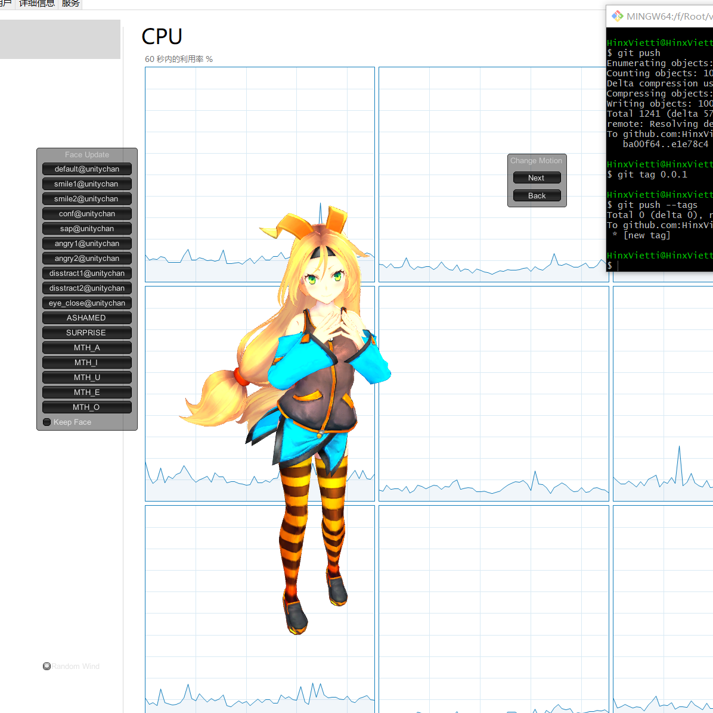

# Unity-Desktop-transparent-app
使用Unity，渲染内容，然后抠图出来，然后再播放到桌面的酷炫功能
> 原文来自简书，[传送门](http://www.baidu.com "传送到知乎")

## 使用
* 直接Clone ，然后打开Unity
* CTRL + B
* 然后查看效果吧

## 注意
* 注意材质的颜色和相机填充的背景颜色要相同
* 注意最好关闭SetResolutions Dialog ,否则会影响win32获取前台窗口的句柄
* 上面那点用Process获取句柄就好了，此处未改bug
* 这个只是基础Demo,要功能自己改就好啦

## 看看效果

* build and run



## 原理 流程图

```flow

​```flow
st=>start: START
op_1=>operation: UNITY RENDER
op_2=>operation: CLEAR BACKGROUND
op_3=>operation: NOTIFY WIN-32 CLEAR WINDOW
e=>end: 结束
st->op_1->op_2->op_3->e
&```

```
